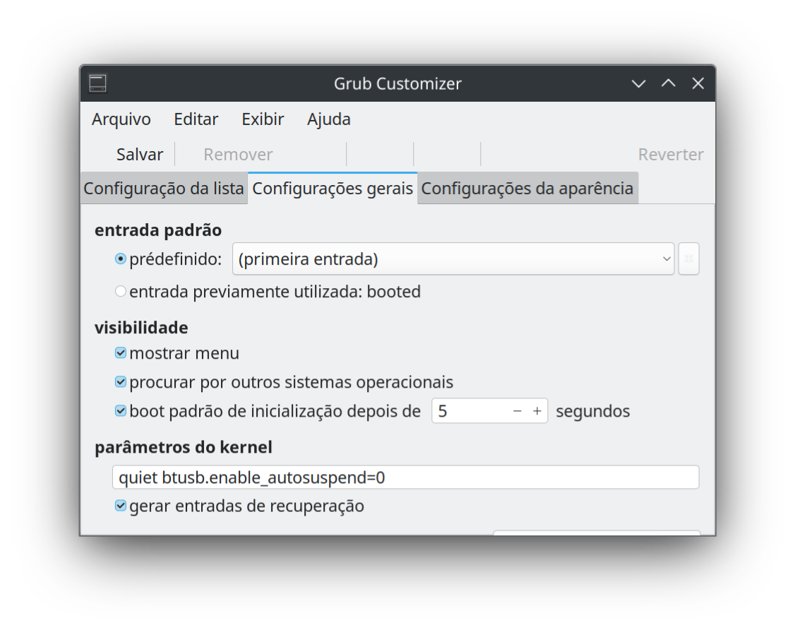

# Debian Setup

## Install Solaar for better Logitech mouse support

- https://pwr-solaar.github.io/Solaar
- https://github.com/pwr-Solaar/Solaar

```bash
sudo apt-get install solaar
```

## Fix Bluetooh mouse lag

Add `btusb.enable_autosuspend=0` to kernal parameter on Grub Customizer, and
save.



## Webcam drivers (TODO)

*Still need to figure it out how to install or configure it

- https://github.com/intel/ipu6-drivers
- https://wiki.debian.org/InstallingDebianOn/Dell/XPS%2013%209320%20(2023)%20(bookworm)#Camera
