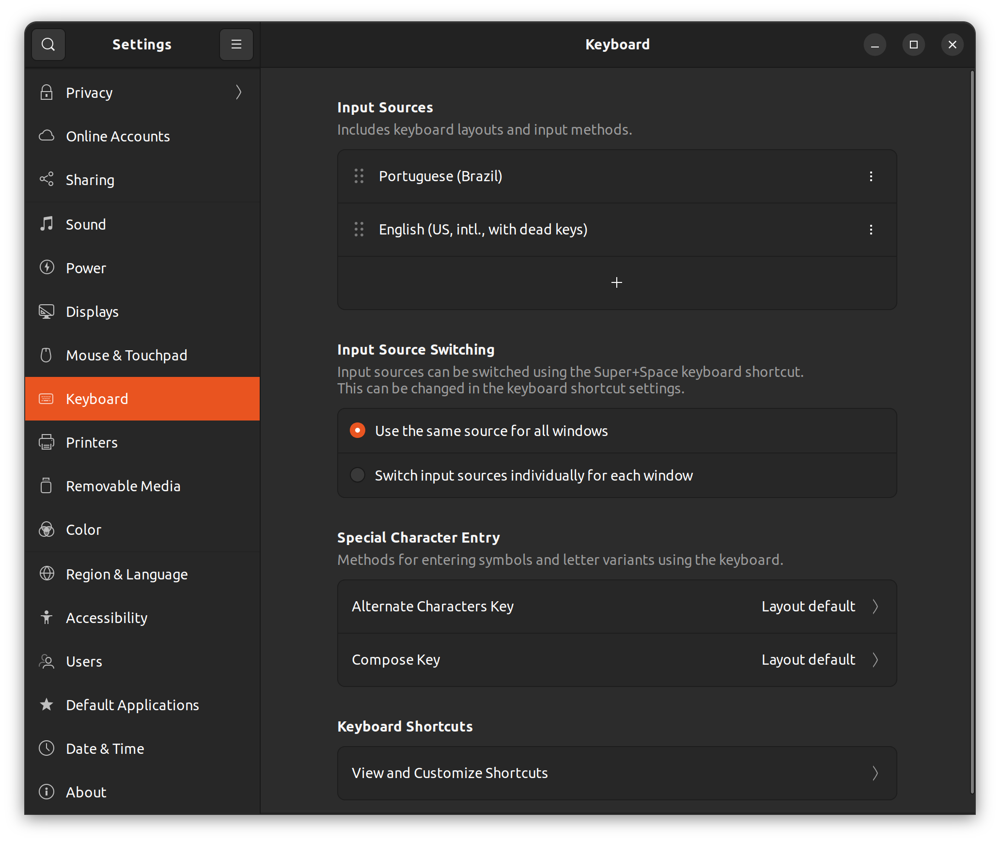
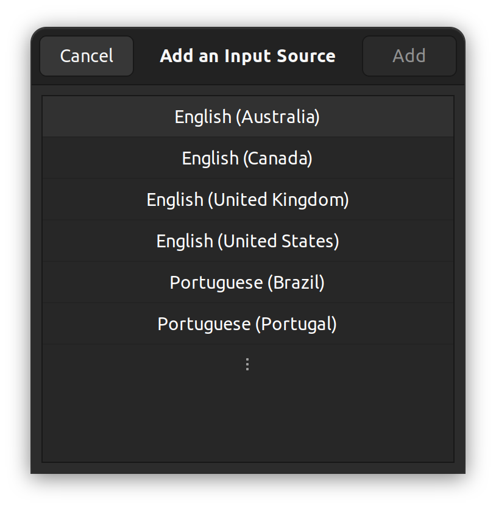

# Ubuntu Setup for Samsung Galaxy Book3 Ultra

## Remove snap

Use this script: https://github.com/polkaulfield/ubuntu-debullshit

Software Center [needs to be reinstalled](https://askubuntu.com/a/1229805):

```
sudo apt install gnome-software
```

## Fix sound

Run the `fix-sound.sh` file in this repository:

```bash
sudo fix-sound.sh
```

Source: https://github.com/thesofproject/linux/issues/4055#issuecomment-1332331409

## Enable international keyboard

Settings > Keyboard. Add input source, click on "English (United States)" and a
third page will be shown with "English (intl, with dead keys)".






Then, edit `/etc/environment` and add the following line to fix the insertion
of `ç`:

```bash
GTK_IM_MODULE=cedilla
```

Log off and log in again for the change to take effect.
